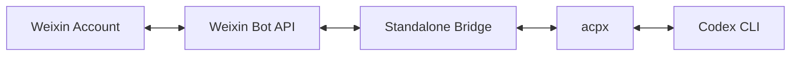

# Weixin Codex Bridge

[](https://github.com/leilong611-ai/weixin-codex-bridge/actions/workflows/public-check.yml)

A standalone bridge from Weixin to Codex without OpenClaw routing.

It talks to the Weixin bot HTTP API directly for QR login, message polling, replies, and typing state, then uses `acpx` to map each Weixin user to an isolated Codex session.

Chinese version: [README.md](./README.md)

## Architecture



Target flow:

`Weixin -> standalone bridge -> acpx -> Codex`

This repo does not rely on OpenClaw channel routing, bindings, or agent dispatching.

## Screenshots

### 1. Login flow


The public repo uses a sanitized illustrative screenshot here. Real QR codes, account IDs, and local paths are intentionally excluded from the published materials.

### 2. Doctor output


Use `doctor` before login to verify workspace, `acpx`, and the saved runtime state.

### 3. Message round trip


After a text message arrives from Weixin, the bridge sends typing, prompts the matching Codex session, and returns a plain-text reply.

## Features

- QR login for Weixin bot accounts
- Direct-message text chat
- One persistent Codex session per Weixin user
- Typing state support
- `/new` and `/reset` to reset the current user's session
- Local runtime state under `.local/`

## Current Scope

Included in v0.1:

- Direct-message text only
- Single-agent routing
- Plain-text replies

Not included yet:

- Group chat routing
- Media upload and download
- Multi-agent dispatch

## Requirements

- Node.js `>= 22`
- Local `codex` CLI installed and already authenticated
- Network access to the Weixin bot API and npm

## Quick Start

```bash
git clone <your-repo-url>
cd weixin-codex-bridge
npm install
```

Verify `acpx` can see your target workspace:

```bash
node src/cli.mjs doctor --workspace "/path/to/your/workspace"
```

Link a Weixin account:

```bash
node src/cli.mjs login --workspace "/path/to/your/workspace"
```

During login, the bridge outputs:

- A terminal QR code
- A local QR image at `.local/login-qr.png`

Start the bridge:

```bash
node src/cli.mjs serve
```

Or do login + serve in one step:

```bash
node src/cli.mjs start --workspace "/path/to/your/workspace"
```

## Useful Commands

```bash
node src/cli.mjs doctor
node src/cli.mjs logout
npm run public-check
```

## Repository Layout

```text
src/
  cli.mjs
  login.mjs
  bridge.mjs
  weixin-api.mjs
  codex-runner.mjs
  text.mjs
  state.mjs
  config.mjs
  log.mjs
  paths.mjs
docs/
  build-process.md
  configuration.md
  faq.md
  privacy-and-publish-checklist.md
scripts/
  public-check.sh
```

## Configuration and FAQ

- [docs/configuration.md](./docs/configuration.md)
- [docs/faq.md](./docs/faq.md)

## Privacy and Publishing

- `.local/` is ignored and must never be committed
- Run `npm run public-check` before publishing changes
- See [docs/privacy-and-publish-checklist.md](./docs/privacy-and-publish-checklist.md) for the release checklist

## References

- Tencent Weixin OpenClaw installer: <https://www.npmjs.com/package/@tencent-weixin/openclaw-weixin-cli>
- Tencent Weixin OpenClaw plugin: <https://www.npmjs.com/package/@tencent-weixin/openclaw-weixin>
- OpenClaw ACP Agents: <https://docs.openclaw.ai/tools/acp-agents>
- OpenClaw ACP CLI: <https://docs.openclaw.ai/cli/acp>
- ACPX: <https://www.npmjs.com/package/acpx>

## Notes

This repository focuses on the standalone "Weixin directly to Codex" approach. If you want to reuse OpenClaw routing itself, that is a different architecture and intentionally out of scope here.

## License

MIT
