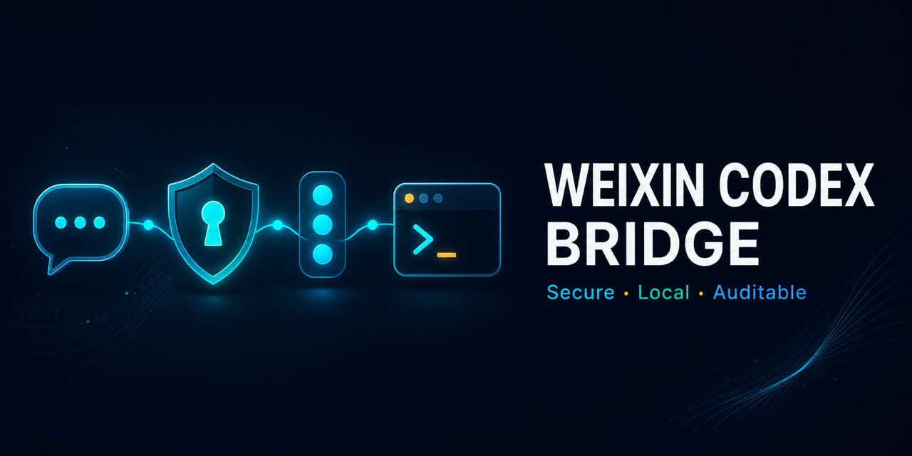

# Weixin Codex Bridge

**Security-first, local-first WeChat bridge for Codex.**

[](https://github.com/leilong611-ai/weixin-codex-bridge/actions/workflows/ci.yml)
[](https://github.com/leilong611-ai/weixin-codex-bridge/stargazers)
[](LICENSE)

A focused bridge that connects WeChat messages to local Codex while preserving allowlists, session isolation, a workspace sandbox, and a recoverable SQLite inbox.

`Default-deny` · `Session isolation` · `Sandboxed execution` · `Durable recovery`



`WeChat → Authorization → Durable Inbox → Codex → WeChat`

Chinese version: [README.md](./README.md)

---

## What problem does it solve?

Codex runs on your local machine, but the high-frequency communication channel is often WeChat.

This project creates a well-bounded bridge layer between the two:

- Authenticate via WeChat QR login
- Authorize users via allowlist and role system (owner / allowed / readonly)
- Isolate each WeChat peer to a dedicated session key
- Route authorized text messages to Codex Desktop or Codex CLI
- Send execution results back to WeChat with safe reply splitting
- Persist messages in a SQLite durable queue to reduce silent-loss risk on restart
- Enforce default security restrictions on the console, logs, workspace, and local data

## Architecture

```
WeChat User → WeChat Bot API → Authorization → SQLite Durable Inbox
                                              → Session Scheduler
                                              → Codex Desktop / CLI
                                              → Response → WeChat
```

**Trust boundaries:**

| Boundary | Trust Level |
|----------|-------------|
| WeChat user | **Untrusted** — requires role-based authorization |
| WeChat input | **Untrusted** — external input, possible injection vector |
| Codex output | **May contain sensitive content** — redacted in logs and storage |
| SQLite data | Local private directory, periodic cleanup, payload scrubbing |

## Default Security Policy

Default-deny and least-privilege:

| Capability | Default |
|------------|---------|
| Unauthorized WeChat users | Rejected with generic refusal |
| Codex `--full-auto` | Disabled |
| Codex `--skip-git-repo-check` | Disabled |
| Local console | Disabled (needs explicit enable + token) |
| Full transcript storage | Disabled |
| Store full failed prompts | Disabled |
| Log level | `minimal` (no message content) |
| Codex workspace | Must pass sandbox path validation |

Even with an allowlist configured, do not use `$HOME`, `.ssh`, `.codex`, browser data directories, or primary repository roots as the Codex workspace.

## Capabilities

- QR code login for WeChat bot accounts
- Owner / allowed / readonly role authorization with command-level access control
- Unknown users rejected by default with a generic response that does not disclose internal state
- Deterministic session key per (account, peer) — no cross-user leakage
- Codex Desktop automation (primary delivery mode)
- Codex CLI mode (optional, with Desktop fallback on failure)
- Sandbox workspace validation
- SQLite WAL durable message queue
- Account-scoped message UID deduplication (`weixin:<hash>:msg:<id>`)
- Lease token + heartbeat for safe long-running tasks
- Crash recovery — recover expired leases before contacting WeChat API
- Authenticated local console with CSRF/Origin/Host checks
- Log redaction (tokens, account IDs, paths, emails, phone numbers)
- Data retention cleanup (default 7 days)
- npm package content verification in CI

## Message Reliability

The bridge uses a SQLite Durable Inbox to manage WeChat messages.

**Normal flow:**

1. Fetch messages from WeChat API
2. Batch-write to inbox + update cursor atomically (`BEGIN IMMEDIATE` / `COMMIT`)
3. Worker claims next pending message, receives a unique lease token
4. Heartbeat renews lease every 30s during execution
5. Success → mark completed, auto-scrub payload (raw_json, text cleared)
6. Failure (retryable) → mark failed, retain minimal context for retry
7. Failure (exhausted) → mark dead, payload scrubbed
8. Crash → on restart, recover expired leases, drain pending before contacting WeChat

**Deduplication:**

- Message UID = `weixin:<account_hash>:msg:<message_id>` or `weixin:<account_hash>:hash:<body_hash>`
- Same message from same account always produces the same UID
- `ON CONFLICT(account_key, message_uid) DO NOTHING` — duplicate fetch does not duplicate execution
- Different accounts never conflict even with the same message_id

**Safeguards:**

- SQLite errors (disk full, corruption, I/O) throw — never silently treated as "duplicate"
- Wrong lease token cannot complete/fail a message
- Old worker cannot overwrite new worker's state
- All state transitions verify `id + lease_token` match

## Data Storage and Privacy

Database location: `{state_root}/sqlite/bridge.db` (mode 0600, directory 0700).

**Data lifecycle:**

| Phase | Stored Content |
|-------|----------------|
| pending / processing | Minimal fields for processing; raw_json only if `full-debug` log level |
| completed | Audit-only: message_uid, account_key, peer_hash, status, timestamps |
| skipped / rejected | Same as completed — no payload |
| failed | Text summary (max 2000 chars), no raw_json |
| dead | Same as failed |
| failed_tasks table | Cleared on cleanup; prompt and error (redacted) |

**Not stored by default:**

- Full WeChat API response (raw_json)
- Full message text content (in non-debug modes)
- Tokens, cookies, credentials, or session secrets
- Real peer IDs in the database (stored as hashes where appropriate)

## User Roles

| Role | Capability |
|------|------------|
| owner | All: normal messages, management commands, diagnostics, model switching |
| allowed | Normal messages to own session only, public status/help commands |
| readonly | Public status / help commands — never triggers Codex execution |
| unknown | Rejected with generic refusal — no information leakage |

## Requirements

- Node.js 22+ (uses `node:sqlite`)
- Windows 10/11 for Codex Desktop automation
- Installed and logged-in Codex Desktop, or Codex CLI
- A WeChat client that can confirm QR login, or existing WeChat/OpenClaw state
- Dedicated, isolated Codex workspace directory

## Quick Start

```bash
git clone https://github.com/leilong611-ai/weixin-codex-bridge.git
cd weixin-codex-bridge
npm ci
npm run build
npm run login
npm run accounts
```

`npm run login` renders the WeChat QR code directly in the terminal. The QR payload is never written to a file or log; each account credential file is written by atomic replacement in the private local state directory. Existing OpenClaw WeChat accounts remain readable without migration.

Common CLI commands:

| Action | Command |
|---|---|
| QR login | `npm run login` |
| List accounts and sources | `npm run accounts` |
| Read-only preflight | `npm run doctor` |
| Start the bridge | `npm start` |
| Remove a bridge-managed account | `npm run logout -- <account-id>` |
| Print version or help | `node dist/cli.js version` / `node dist/cli.js help` |

**Note:** The project does not read `.env` automatically. Export variables via shell or process manager.

### Minimal Security Configuration (Linux / macOS)

```bash
export CODEX_WEIXIN_OWNER_PEER_IDS=wxid_example_owner
export CODEX_WEIXIN_DEFAULT_DENY=true
export CODEX_WEIXIN_CWD=/absolute/path/to/sandbox/project
export CODEX_WEIXIN_SANDBOX_ROOT=/absolute/path/to/sandbox
export CODEX_WEIXIN_EXECUTION_MODE=restricted
export CODEX_WEIXIN_ALLOW_FULL_AUTO=false
export CODEX_WEIXIN_ALLOW_SKIP_GIT_CHECK=false
export CODEX_WEIXIN_CONSOLE_ENABLED=false
export CODEX_WEIXIN_LOG_LEVEL=minimal
export CODEX_WEIXIN_TRANSCRIPT_ENABLED=false
export CODEX_WEIXIN_STORE_FULL_PROMPTS=false
export CODEX_WEIXIN_DATA_RETENTION_DAYS=7
```

### Start the Bridge

After exporting the security configuration, run the read-only preflight:

```bash
npm run doctor
```

It checks Node.js, Codex/Weixin state paths, workspace sandboxing, role allowlists, execution mode, and privacy defaults. It never prints tokens, peer IDs, or QR data. Incomplete configuration produces actionable output and a non-zero exit status.

If you already have an OpenClaw WeChat login, skip `npm run login` and point `OPENCLAW_STATE_DIR` at the state root containing `openclaw-weixin/accounts.json`.

Windows users can run the read-only preflight:

```bash
npm run doctor
npm run setup-check
```

macOS/Linux currently support the `codex-cli` path only, not Windows Desktop UI automation. Contributors can run a sanitized local validation that creates only a temporary workspace, placeholder account state, and fake Codex command; it does not connect to Weixin or execute Codex:

```bash
npm run build
npm run validate:cli-only
```

Real operation still requires an installed Codex CLI, an isolated workspace, and one usable WeChat login.

Once configuration and login state are ready:

```bash
npm start
```

## Tests

```bash
npm ci
npm run build
npm test -- --run
npm run public-check
npm run pack:verify
```

CI runs the complete platform-appropriate suite on Windows and Linux, followed by public-repository and extracted-package checks.

## Known Limitations

- Codex Desktop automation is primarily designed for Windows
- UI automation may be affected by window state, DPI scaling, and Codex Desktop updates
- WeChat / OpenClaw API changes may affect message fetching
- High-risk execution mode transfers additional risk to the user
- This project **cannot prevent** prompt injection attacks
- This project **cannot guarantee** the safety of every command Codex generates
- Git branches, code review, and backups are still recommended for production repositories

## Scope

The current scope is private WeChat text messages, one focused bridge, local Codex execution, and security-first routing.

macOS/Linux support the `codex-cli` path. Media messages and group chat still require security design or validation first. A multi-agent platform, universal IM gateway, hosted SaaS, and complete agent orchestration are out of scope.

## Security Recommendations

1. Run the bridge under a dedicated, non-admin system account
2. Always use a dedicated sandbox directory as the Codex workspace
3. Never use `$HOME`, `.ssh`, `.codex`, browser data, or production repos as workspace
4. Keep `--full-auto` disabled unless the environment is fully isolated
5. Run periodic data cleanup (auto-cleanup runs every 7 days by default)
6. Keep Node.js, Codex, and all dependencies updated
7. Review Codex-generated diffs before merging
8. Never expose the local console to a network (LAN or WAN)

## Documents

- [SECURITY.md](./SECURITY.md) — threat model, vulnerability reporting
- [docs/threat-model-walkthrough.md](./docs/threat-model-walkthrough.md) — end-to-end reviewer walkthrough
- [CONTRIBUTING.md](./CONTRIBUTING.md) — development guide, PR checklist
- [CHANGELOG.md](./CHANGELOG.md) — version history
- [LICENSE](./LICENSE) — MIT

## References

- [WeChat OpenClaw CLI](https://www.npmjs.com/package/@tencent-weixin/openclaw-weixin-cli)
- [WeChat OpenClaw Plugin](https://www.npmjs.com/package/@tencent-weixin/openclaw-weixin)
- [OpenClaw ACP Agents](https://docs.openclaw.ai/tools/acp-agents)
- [ACPX](https://www.npmjs.com/package/acpx)

---

**If this project helped you, please give it a Star ⭐**

[Report Bug](https://github.com/leilong611-ai/weixin-codex-bridge/issues) · [Request Feature](https://github.com/leilong611-ai/weixin-codex-bridge/issues)
