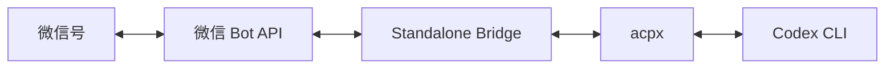
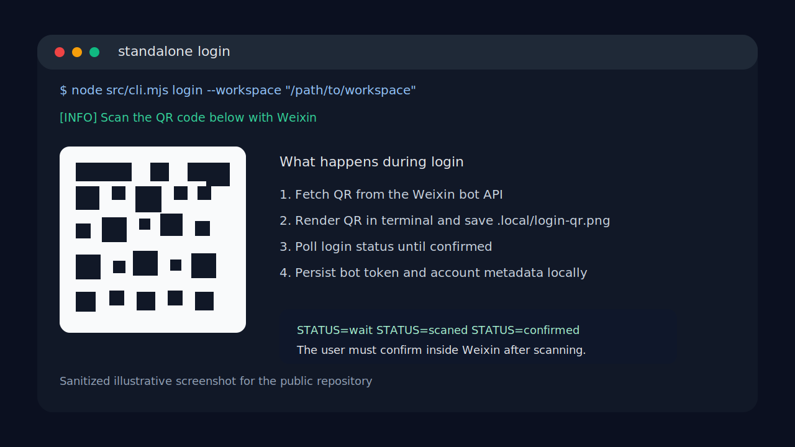
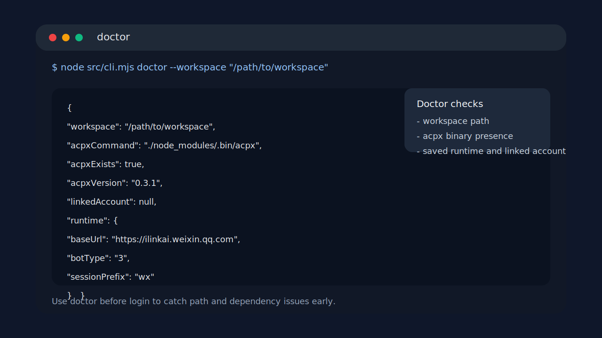
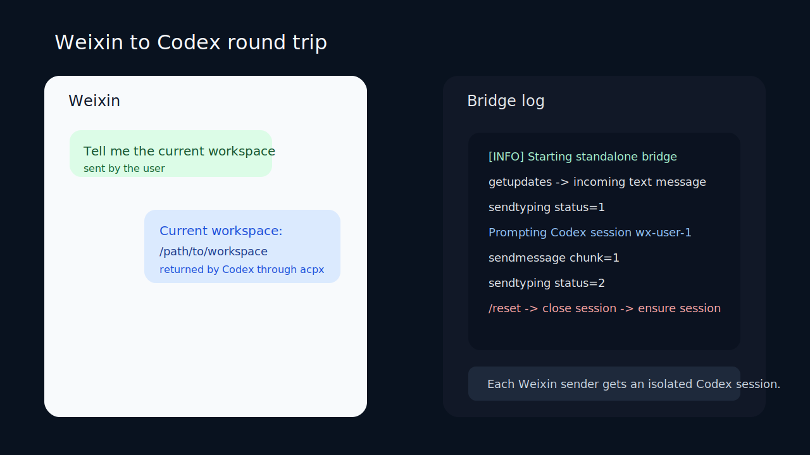

<div align="center">

# Weixin Codex Bridge

**不依赖 OpenClaw routing 的微信到 Codex standalone bridge**

[](https://github.com/leilong611-ai/weixin-codex-bridge/actions/workflows/public-check.yml)
[](https://github.com/leilong611-ai/weixin-codex-bridge/stargazers)
[](LICENSE)

扫码登录 · 消息转发 · 会话隔离 · Typing 同步

English version: [README.en.md](./README.en.md)

</div>

---

它直接调用微信 bot HTTP API 完成扫码登录、收发消息和 typing 状态，再通过 `acpx` 把每个微信用户绑定到一个独立的 Codex 会话。

## 架构



目标链路：`微信 -> standalone bridge -> acpx -> Codex`

不走 OpenClaw 的 channel routing、bindings 或 agent 分发。

## 截图

### 1. 登录流程



扫码登录时，bridge 会同时输出终端二维码并保存 `.local/login-qr.png`。

### 2. 诊断输出



`doctor` 用来在登录前检查工作区、`acpx` 和当前本地运行态。

### 3. 消息往返



收到微信文本后，bridge 会先发 typing，再进入对应的 Codex 会话，最后把纯文本回复拆块送回微信。

## 功能

- 微信扫码登录
- 私聊文本消息收发
- 每个微信用户一个持久 Codex 会话
- typing 状态同步
- `/new` 和 `/reset` 重置当前用户会话
- 本地状态保存在 `.local/`

## 当前范围

| 已覆盖 | 暂未覆盖 |
|--------|---------|
| 私聊文本 | 群聊路由 |
| 单 agent | 图片、视频、文件上传下载 |
| 纯文本回复 | 多 agent 分发 |

## 环境要求

- Node.js `>= 22`
- 本机已安装并登录 `codex`
- 网络可访问微信 bot API 和 npm

## 快速开始

```bash
git clone https://github.com/leilong611-ai/weixin-codex-bridge.git
cd weixin-codex-bridge
npm install
```

先确认 `acpx` 能找到你的工作区：

```bash
node src/cli.mjs doctor --workspace "/path/to/your/workspace"
```

扫码登录：

```bash
node src/cli.mjs login --workspace "/path/to/your/workspace"
```

启动 bridge：

```bash
node src/cli.mjs serve
```

## 常用命令

```bash
node src/cli.mjs doctor    # 环境检查
node src/cli.mjs logout    # 登出
npm run public-check       # 发布前检查
```

## 配置与 Q&A

- [docs/configuration.md](./docs/configuration.md)
- [docs/faq.md](./docs/faq.md)

## 隐私与发布

- `.local/` 已加入 `.gitignore`，token、账号信息不进仓库
- 发布前运行 `npm run public-check`
- 详见 [docs/privacy-and-publish-checklist.md](./docs/privacy-and-publish-checklist.md)

## 参考资料

- 腾讯微信 OpenClaw 安装器：<https://www.npmjs.com/package/@tencent-weixin/openclaw-weixin-cli>
- 腾讯微信 OpenClaw 插件：<https://www.npmjs.com/package/@tencent-weixin/openclaw-weixin>
- OpenClaw ACP Agents：<https://docs.openclaw.ai/tools/acp-agents>
- ACPX：<https://www.npmjs.com/package/acpx>

---

<div align="center">

**如果这个项目帮到了你，请给个 Star ⭐**

[Report Bug](https://github.com/leilong611-ai/weixin-codex-bridge/issues) · [Request Feature](https://github.com/leilong611-ai/weixin-codex-bridge/issues) · [Discussions](https://github.com/leilong611-ai/weixin-codex-bridge/discussions)

</div>
