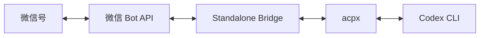

# Weixin Codex Bridge

一个不依赖 OpenClaw routing 的微信到 Codex standalone bridge。

English version: [README.en.md](./README.en.md)

它直接调用微信 bot HTTP API 完成扫码登录、收发消息和 typing 状态，再通过 `acpx` 把每个微信用户绑定到一个独立的 Codex 会话。

## 架构



目标链路：

`微信 -> standalone bridge -> acpx -> Codex`

不走 OpenClaw 的 channel routing、bindings 或 agent 分发。

## 功能

- 微信扫码登录
- 私聊文本消息收发
- 每个微信用户一个持久 Codex 会话
- typing 状态同步
- `/new` 和 `/reset` 重置当前用户会话
- 本地状态保存在 `.local/`

## 当前范围

第一版只覆盖：

- 私聊文本
- 单 agent
- 纯文本回复

暂未覆盖：

- 群聊路由
- 图片、视频、文件上传下载
- 多 agent 分发

## 环境要求

- Node.js `>= 22`
- 本机已安装并登录 `codex`
- 网络可访问微信 bot API 和 npm

## 快速开始

```bash
git clone <your-repo-url>
cd weixin-codex-bridge
npm install
```

先确认 `acpx` 能找到你的工作区：

```bash
node src/cli.mjs doctor --workspace "/path/to/your/workspace"
```

扫码登录：

```bash
node src/cli.mjs login --workspace "/path/to/your/workspace"
```

登录时会输出：

- 终端二维码
- `.local/login-qr.png` 本地二维码图片

启动 bridge：

```bash
node src/cli.mjs serve
```

如果还没登录，也可以一步完成：

```bash
node src/cli.mjs start --workspace "/path/to/your/workspace"
```

## 常用命令

```bash
node src/cli.mjs doctor
node src/cli.mjs logout
npm run public-check
```

## 项目结构

```text
src/
  cli.mjs            # 命令行入口
  login.mjs          # 微信扫码登录
  bridge.mjs         # 消息轮询和转发
  weixin-api.mjs     # 微信 bot HTTP API 封装
  codex-runner.mjs   # acpx / Codex 调用
  text.mjs           # 文本提取和拆分
  state.mjs          # 本地状态文件
  config.mjs         # 运行配置
  log.mjs            # 本地日志
  paths.mjs          # 路径定义
docs/
  build-process.md
  privacy-and-publish-checklist.md
scripts/
  public-check.sh
```

## 隐私与发布

- `.local/` 已加入 `.gitignore`，其中的 token、账号信息、同步游标和日志都不应提交
- 发布前先运行 `npm run public-check`
- 发布流程和人工检查项见 [docs/privacy-and-publish-checklist.md](./docs/privacy-and-publish-checklist.md)

## 参考资料

- 腾讯微信 OpenClaw 安装器：<https://www.npmjs.com/package/@tencent-weixin/openclaw-weixin-cli>
- 腾讯微信 OpenClaw 插件：<https://www.npmjs.com/package/@tencent-weixin/openclaw-weixin>
- OpenClaw ACP Agents：<https://docs.openclaw.ai/tools/acp-agents>
- OpenClaw ACP CLI：<https://docs.openclaw.ai/cli/acp>
- ACPX：<https://www.npmjs.com/package/acpx>

## 说明

这个仓库的重点是“微信直连 Codex 的 standalone 方案”。如果你的目标是复用 OpenClaw 自带路由能力，那是另一条架构路线，不在本仓库范围内。
