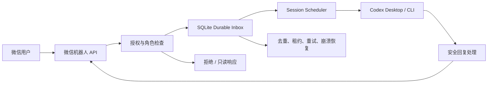

# Weixin Codex Bridge

**Security-first, local-first WeChat bridge for Codex.**

把微信消息安全地连接到本地 Codex，同时保留白名单、会话隔离、Workspace 沙箱和可恢复 SQLite 消息队列。

`Default-deny` · `Session isolation` · `Sandboxed execution` · `Durable recovery`


[](https://github.com/leilong611-ai/weixin-codex-bridge/actions/workflows/ci.yml)
[](https://github.com/leilong611-ai/weixin-codex-bridge/stargazers)
[](LICENSE)

`WeChat → Authorization → Durable Inbox → Codex → WeChat`

English: [README.en.md](./README.en.md)

> **重要说明：** 微信消息属于外部不可信输入。项目默认拒绝未授权用户，默认关闭高权限 Codex 参数和本地控制台。但使用者仍需为 Codex 配置独立工作目录，并理解本地自动执行带来的风险。

---

## 项目解决什么问题

Codex 通常运行在电脑本地，而高频沟通入口往往在微信中。

本项目在两者之间建立一个边界明确的桥接层：

- 从已登录的微信机器人账号读取消息
- 对微信用户进行白名单和角色鉴权
- 为不同微信会话建立隔离的本地 session
- 将允许的文本消息交给 Codex Desktop 或 Codex CLI
- 将执行结果安全回复到微信
- 使用 SQLite 持久队列降低程序重启时消息静默丢失的风险
- 对控制台、日志、工作目录和本地数据实施默认安全限制

## 架构


```mermaid
flowchart LR
    A[微信用户] --> B[微信机器人 API]
    B --> C[授权与角色检查]
    C --> D[SQLite Durable Inbox]
    D --> E[Session Scheduler]
    E --> F[Codex Desktop / CLI]
    F --> G[安全回复处理]
    G --> B

    C --> H[拒绝 / 只读响应]
    D --> I[去重、租约、重试、崩溃恢复]
```

**信任边界：**

| 边界 | 信任等级 |
|------|----------|
| 微信用户 | **不可信** — 需要授权检查 |
| 微信消息 | **不可信** — 外部输入 |
| Codex 输出 | **可能含敏感内容** — 需脱敏 |
| SQLite 数据 | 只保存于本地私有状态目录，定期清理 |

## 默认安全策略

项目采用默认拒绝和最小权限原则：

| 能力 | 默认状态 |
|------|----------|
| 未授权微信用户 | 拒绝 |
| `--full-auto` | 关闭 |
| `--skip-git-repo-check` | 关闭 |
| 本地控制台 | 关闭 |
| 完整 transcript | 关闭 |
| 保存完整失败 prompt | 关闭 |
| 日志等级 | `minimal` |
| Codex 工作目录 | 必须通过沙箱校验 |

即使启用了白名单，也不建议将个人主目录、`.ssh`、`.codex`、浏览器数据目录或主力代码仓库根目录直接作为 Codex workspace。

## 主要能力

- 微信二维码登录与账号读取
- owner / allowed / readonly 角色授权
- 未知用户默认拒绝
- 每个微信会话独立 session key
- Codex Desktop 自动化
- Codex CLI 可选模式
- 工作目录安全检查
- SQLite WAL 持久消息队列
- account-scoped message UID 幂等去重
- lease token 与心跳机制
- 崩溃恢复和失败重试
- 本地控制台认证
- 日志脱敏和数据保留期限
- Windows 与 Linux CI
- npm 包内容验证

## 消息可靠性

桥接器使用 SQLite Durable Inbox 管理微信消息。

**正常流程：**

1. 拉取微信消息
2. 在一个事务中批量写入 inbox + 更新 cursor（原子提交）
3. worker 领取消息并获得 lease token
4. 运行期间通过心跳续租
5. 成功后标记 completed，payload 自动清除
6. 失败后进入 retry 或 dead 状态
7. 进程重启时优先恢复 lease 已过期的消息，再连接微信 API

**去重与隔离：**

- message UID 包含 account hash（`weixin:<hash>:msg:<id>`），不同账号不会冲突
- 重复拉取不会重复执行 Codex
- SQLite 唯一键冲突安全处理（`ON CONFLICT DO NOTHING`），不吞没其他错误

**限制：**

系统通过幂等 UID、租约和状态条件更新尽量避免重复执行，但在不可控的外部系统故障场景中，调用方仍应尽可能使用幂等操作。

## 数据存储与隐私

SQLite 数据库默认保存在配置的本地状态目录。

**数据生命周期：**

| 阶段 | 存储内容 |
|------|----------|
| pending / processing | 处理所需非敏感内容（受日志等级控制） |
| completed | 只保留最小审计字段（message_uid, status, timestamps） |
| skipped / rejected | 无 payload |
| failed / dead | 只保留失败摘要 |
| full-debug 模式 | 保存更多信息，但仅限隔离环境短期使用 |

**默认不长期保存：**

- 完整微信消息原文
- 完整 Codex transcript
- 完整失败 prompt
- token、cookie 或凭据

## 本地控制台

- 默认关闭
- 需要 Bearer token + Origin / Host / CSRF 校验
- 不建议暴露到局域网或公网
- 反向代理不能替代本项目认证

## 用户角色

| 角色 | 能力 |
|------|------|
| owner | 普通消息、管理命令、状态和维护功能 |
| allowed | 只能向自己的会话发送普通消息 |
| readonly | 只能查看允许公开的只读状态 |
| unknown | 默认拒绝 |

## 环境要求

- Node.js 22+
- Windows 10/11：使用 Codex Desktop 自动化
- 已安装并登录 Codex Desktop，或已安装 Codex CLI
- 可扫码确认登录的微信客户端；也兼容已有微信/OpenClaw 登录态
- 一个专用、隔离的 Codex workspace

## 快速开始

```bash
git clone https://github.com/leilong611-ai/weixin-codex-bridge.git
cd weixin-codex-bridge
npm ci
npm run build
npm run login
npm run accounts
```

`npm run login` 直接在终端显示微信二维码。二维码内容不会写入文件或日志；每个账号凭据文件会以原子替换方式写入本机私有状态目录。已有 OpenClaw 微信账号仍可直接读取，无需迁移。

常用 CLI：

| 操作 | 命令 |
|---|---|
| 二维码登录 | `npm run login` |
| 列出账号及来源 | `npm run accounts` |
| 只读预检 | `npm run doctor` |
| 启动桥接器 | `npm start` |
| 删除本项目管理的账号 | `npm run logout -- <account-id>` |
| 查看版本或帮助 | `node dist/cli.js version` / `node dist/cli.js help` |

复制配置（注意：项目不会自动读取 `.env`，需要通过 shell 或进程管理器导出环境变量）：

```bash
cp .env.example .env.local
# 然后导出环境变量或通过进程管理器注入
```

### 最小安全配置

```bash
# 微信管理员（至少设置一个）
export CODEX_WEIXIN_OWNER_PEER_IDS=wxid_example_owner
export CODEX_WEIXIN_DEFAULT_DENY=true

# Codex 工作目录（必须隔离）
export CODEX_WEIXIN_CWD=/absolute/path/to/sandbox/project
export CODEX_WEIXIN_SANDBOX_ROOT=/absolute/path/to/sandbox

# 执行模式
export CODEX_WEIXIN_EXECUTION_MODE=restricted
export CODEX_WEIXIN_ALLOW_FULL_AUTO=false
export CODEX_WEIXIN_ALLOW_SKIP_GIT_CHECK=false

# 控制台（默认关闭）
export CODEX_WEIXIN_CONSOLE_ENABLED=false

# 隐私
export CODEX_WEIXIN_LOG_LEVEL=minimal
export CODEX_WEIXIN_TRANSCRIPT_ENABLED=false
export CODEX_WEIXIN_STORE_FULL_PROMPTS=false
export CODEX_WEIXIN_DATA_RETENTION_DAYS=7
```

### 启动

安全配置导出后运行只读预检：

```bash
npm run doctor
```

它会检查 Node.js、Codex/微信状态路径、Workspace 沙箱、角色白名单、执行模式和隐私默认值，不会输出 token、peer ID 或 QR 数据。配置未就绪时以非零状态退出并给出修复建议。

如果你已有 OpenClaw 微信登录态，可以不运行 `npm run login`，只需让 `OPENCLAW_STATE_DIR` 指向包含 `openclaw-weixin/accounts.json` 的状态目录。

Windows 用户可先运行只读预检：

```bash
npm run doctor
npm run setup-check
```

macOS/Linux 当前仅支持 `codex-cli` 路径，不支持 Windows Desktop UI 自动化。贡献者可运行完全脱敏的本地验证；它只创建临时 workspace、占位账号状态和假 Codex 命令，不连接微信、不执行 Codex：

```bash
npm run build
npm run validate:cli-only
```

真实运行时仍需要已安装的 Codex CLI、隔离 workspace 和一个可用的微信登录态。

配置与登录态就绪后启动桥接器：

```bash
npm start
```

## 测试

```bash
npm ci
npm run build
npm test -- --run
npm run public-check
npm run pack:verify
```

测试覆盖：

| 测试组 | 覆盖内容 |
|--------|----------|
| sqliteStore | 插入/去重/领取/完成/失败/批事务/游标/回收/去重 |
| leaseManager | 租约领取/心跳续租/完成/失败/跳过/拒绝/恢复 |
| sqliteMigrations | 空库初始化/幂等/v1→v3升级/版本号/回滚 |
| messageIdentity | account hash/peer hash/message UID 稳定性/跨账号隔离 |
| messagePayload | payload 准备/角色过滤/内容清除/大小限制 |
| dataRetention | 过期数据清理/估计/WAL checkpoint/payload 残留清除 |
| bridge | 消息处理路由/Desktop 失败/CLI 回退/长回复拆分/并行/会话隔离 |
| auth | 角色解析/命令访问/启动守卫 |
| sessionIsolation | session key 确定性/跨用户隔离 |
| accountStore / weixinLogin / cli | 私有账号存储、兼容读取、二维码登录和 CLI 生命周期 |

## 已知限制

- Codex Desktop 自动化目前主要面向 Windows
- UI 自动化可能受窗口状态、DPI 和 Codex Desktop 更新影响
- 微信/OpenClaw 上游接口变化可能影响消息拉取
- 高风险执行模式需要使用者自行承担额外风险
- 本项目**不能消除** prompt injection
- 本项目**不能保证** Codex 生成的每条命令都是安全的
- 对重要仓库仍建议使用 Git 分支、代码审查和备份

## 项目范围

当前范围是微信私聊文本、单一聚焦桥接层、本地 Codex 执行和安全优先路由。

macOS/Linux 已支持 `codex-cli` 路径。媒体消息与群聊仍需先做安全设计或验证；多 agent 平台、通用 IM 网关、托管 SaaS 和完整 agent orchestration 不在项目范围内。

## 安全建议

1. 使用独立系统账号运行桥接器
2. 使用专用 sandbox 目录
3. 不要把主目录、.ssh、.codex 作为 workspace
4. 不要开启 `full-auto`，除非环境已隔离
5. 定期清理 SQLite 数据（默认每 7 天自动清理）
6. 定期更新 Node.js、Codex 和依赖
7. 对生成的代码使用 Git diff 和 PR 审查
8. 不要将本地控制台暴露到公网

## 相关文档

- [CONTRIBUTING.md](./CONTRIBUTING.md) — 贡献指南
- [SECURITY.md](./SECURITY.md) — 安全策略与威胁模型
- [docs/threat-model-walkthrough.md](./docs/threat-model-walkthrough.md) — 端到端威胁模型走查
- [CHANGELOG.md](./CHANGELOG.md) — 版本变更
- [LICENSE](./LICENSE) — MIT 许可

## 参考资料

- 腾讯微信 OpenClaw 安装器：<https://www.npmjs.com/package/@tencent-weixin/openclaw-weixin-cli>
- 腾讯微信 OpenClaw 插件：<https://www.npmjs.com/package/@tencent-weixin/openclaw-weixin>
- OpenClaw ACP Agents：<https://docs.openclaw.ai/tools/acp-agents>
- ACPX：<https://www.npmjs.com/package/acpx>

---

**如果这个项目帮到了你，请给个 Star ⭐**

[Report Bug](https://github.com/leilong611-ai/weixin-codex-bridge/issues) · [Request Feature](https://github.com/leilong611-ai/weixin-codex-bridge/issues)
